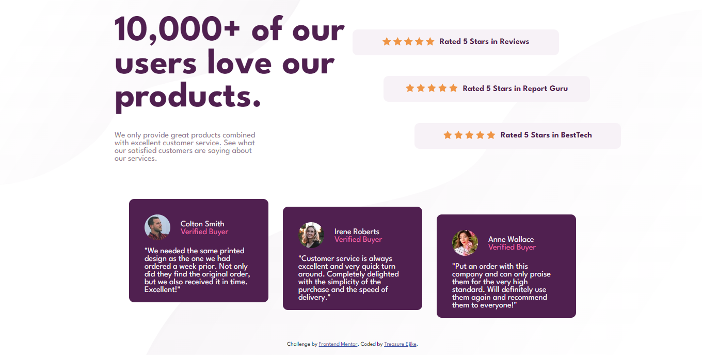

# Frontend Mentor - Social proof section solution

This is a solution to the [Social proof section challenge on Frontend Mentor](https://www.frontendmentor.io/challenges/social-proof-section-6e0qTv_bA).

## Table of contents

- [Overview](#overview)
  - [The challenge](#the-challenge)
  - [Screenshot](#screenshot)
  - [Links](#links)
- [My process](#my-process)
  - [Built with](#built-with)
  - [What I learned](#what-i-learned)
  - [Continued development](#continued-development)
- [Author](#author)

## Overview

### The challenge

Users should be able to:

- View the optimal layout for the section depending on their device's screen size

### Screenshot



### Links

- Solution URL: [https://www.frontendmentor.io/solutions/social-proof-section-dPqf_nasO9](https://www.frontendmentor.io/solutions/social-proof-section-dPqf_nasO9)
- Live Site URL: [https://social-prof-section.netlify.app/](https://social-prof-section.netlify.app/)

## My process

### Built with

- Semantic HTML5 markup
- CSS custom properties
- Flexbox
- Visual Studio Code
- Chrome Developer Tools

### What I learned

  Learned how to add two background images simultaneously and set their positions:

```css
body {
  background: url(./images/bg-pattern-top-desktop.svg),url(./images/bg-pattern-bottom-desktop.svg);
  background-position: left top,right bottom;
  background-repeat: no-repeat;
}
```

### Continued development

  This webpage isn't very responsive so I need to improve on that

## Author

- Frontend Mentor - [@devTetra](https://www.frontendmentor.io/profile/devTetra)
- Twitter - [@tetra_codes](https://twitter.com/tetra_codes)
